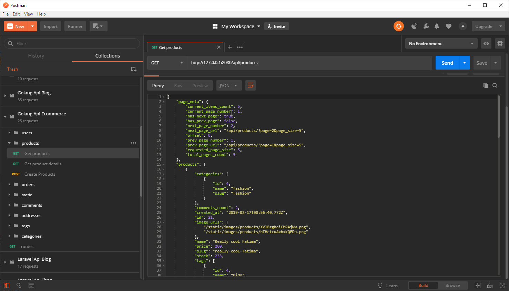
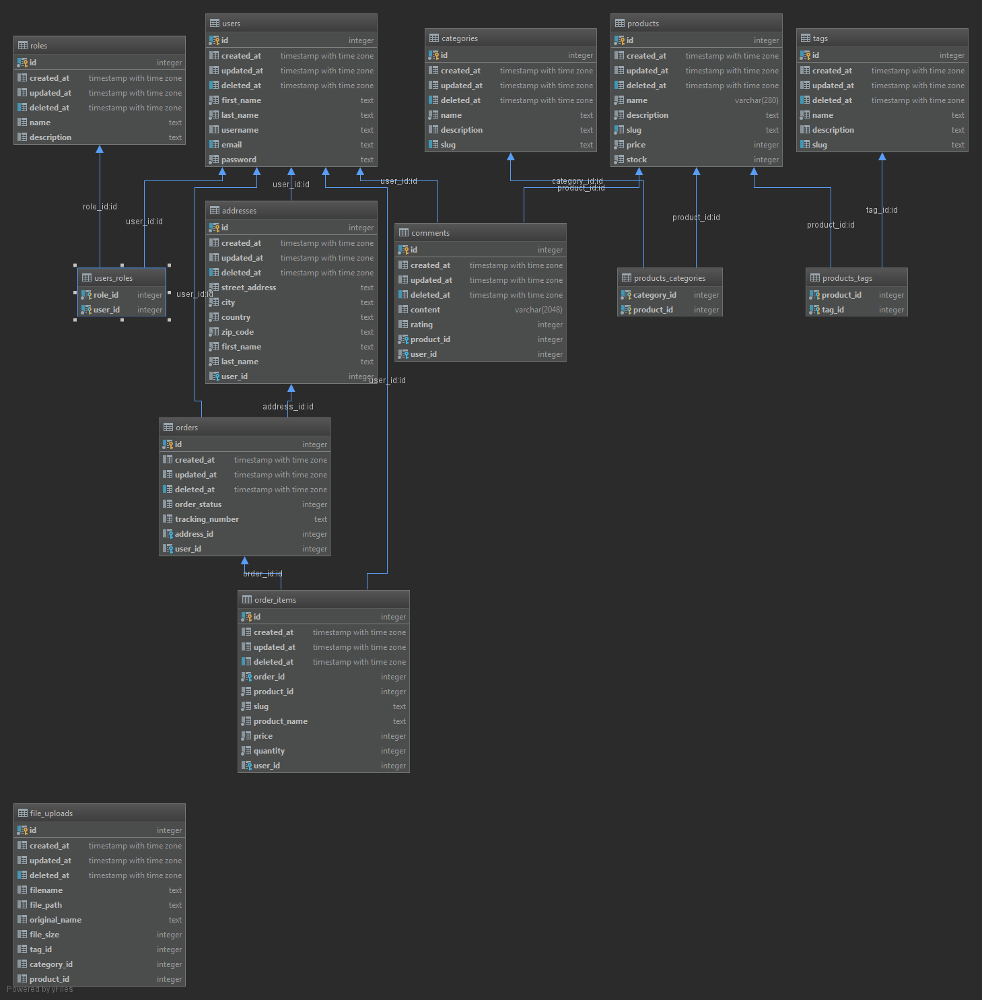

# GoGonicEcommerceApi
# Table of Contents
- [Introduction](#introduction)
- [Full-stack Applications](#full-stack-applications)
  * [E-commerce (shopping cart)](#e-commerce-shopping-cart)
    + [Server side implementations](#server-side-implementations)
    + [Client side implementations](#client-side-implementations)
  * [Blog/CMS](#blogcms)
    + [Server side implementations](#server-side-implementations-1)
    + [Client side](#client-side)
      - [The next come are](#the-next-come-are)
  * [Simple CRUD(Create, Read, Update, Delete)](#simple-crudcreate-read-update-delete)
    + [Server side implementations](#server-side-implementations-2)
    + [Client side implementations](#client-side-implementations-1)
      - [The next come are](#the-next-come-are-1)
  * [CRUD + Pagination](#crud--pagination)
    + [Server side implementations](#server-side-implementations-3)
      - [The next come are](#the-next-come-are-2)
    + [Client side implementations](#client-side-implementations-2)
      - [The next come are](#the-next-come-are-3)
- [Follow me](#social-media-links)
    
# Introduction
This is one of my E-commerce API app implementations. It is written in Golang using go-gonic web framework..
This is not a finished project by any means, but it has a valid enough shape to be git cloned and studied if you are interested in this topic.
If you are interested in this project take a look at my other server API implementations I have made with:

# Full-stack Applications
## E-commerce (shopping cart)
### Server side implementations
- [Spring Boot + Spring Data Hibernate](https://github.com/melardev/SBootApiEcomMVCHibernate)
- [Spring Boot + JAX-RS Jersey + Spring Data Hibernate](https://github.com/melardev/SpringBootEcommerceApiJersey)
- [Node Js + Sequelize](https://github.com/melardev/ApiEcomSequelizeExpress)
- [Node Js + Bookshelf](https://github.com/melardev/ApiEcomBookshelfExpress)
- [Node Js + Mongoose](https://github.com/melardev/ApiEcomMongooseExpress)
- [Python Django](https://github.com/melardev/DjangoRestShopApy)
- [Flask](https://github.com/melardev/FlaskApiEcommerce)
- [Golang go gonic](https://github.com/melardev/api_shop_gonic)
- [Ruby on Rails](https://github.com/melardev/RailsApiEcommerce)
- [AspNet Core](https://github.com/melardev/ApiAspCoreEcommerce)
- [Laravel](https://github.com/melardev/ApiEcommerceLaravel)

The next to come are:
- Spring Boot + Spring Data Hibernate + Kotlin
- Spring Boot + Jax-RS Jersey + Hibernate + Kotlin
- Spring Boot + mybatis
- Spring Boot + mybatis + Kotlin
- Asp.Net Web Api v2
- Elixir
- Golang + Beego
- Golang + Iris
- Golang + Echo
- Golang + Mux
- Golang + Revel
- Golang + Kit
- Flask + Flask-Restful
- AspNetCore + NHibernate
- AspNetCore + Dapper

### Client side implementations
This client side E-commerce application is also implemented using other client side technologies:
- [React Redux](https://github.com/melardev/ReactReduxEcommerceRestApi)
- [React](https://github.com/melardev/ReactEcommerceRestApi)
- [Vue](https://github.com/melardev/VueEcommerceRestApi)
- [Vue + Vuex](https://github.com/melardev/VueVuexEcommerceRestApi)
- [Angular](https://github.com/melardev/AngularEcommerceRestApi)

## Blog/CMS
### Server side implementations
- [Spring Boot + Spring Data Hibernate](https://github.com/melardev/SpringBootApiBlog)
- [Go + Gin Gonic](https://github.com/melardev/GoGonicBlogApi)
- [NodeJs + Mongoose](https://github.com/melardev/ApiBlogExpressMongoose)
- [Laravel](https://github.com/melardev/LaravelApiBlog)
- [Ruby on Rails + JBuilder](https://github.com/melardev/RailsApiBlog)
- [Django + Rest-Framework](https://github.com/melardev/DjangoApiBlog)
- [Asp.Net Core](https://github.com/melardev/AspCoreApiBlog)
- [Flask + Flask-SQLAlchemy](https://github.com/melardev/FlaskApiBlog)

The next to come are:
- Spring Boot + Spring Data Hibernate + Kotlin
- Spring Boot + Jax-RS Jersey + Hibernate + Kotlin
- Spring Boot + mybatis
- Spring Boot + mybatis + Kotlin
- Asp.Net Web Api v2
- Elixir
- Golang + Beego
- Golang + Iris
- Golang + Echo
- Golang + Mux
- Golang + Revel
- Golang + Kit
- Flask + Flask-Restful
- AspNetCore + NHibernate
- AspNetCore + Dapper

### Client side
- [Vue + Vuex](https://github.com/melardev/VueVuexBlog)
- [Vue](https://github.com/melardev/VueBlog)
- [React + Redux](https://github.com/melardev/ReactReduxBlog)
- [React](https://github.com/melardev/ReactBlog)
- [Angular](https://github.com/melardev/AngularBlog)

The next come are
- Angular NgRx-Store
- Angular + Material
- React + Material
- React + Redux + Material
- Vue + Material
- Vue + Vuex + Material
- Ember

## Simple CRUD(Create, Read, Update, Delete)
### Server side implementations
- [Spring Boot + Spring Data Hibernate](https://github.com/melardev/SpringBootApiJpaCrud)
- [Spring boot + Spring Data Reactive Mongo](https://github.com/melardev/SpringBootApiReactiveMongoCrud)
- [Spring Boot + Spring Data Hibernate + Jersey](https://github.com/melardev/SpringBootApiJerseySpringDataCrud)
- [NodeJs Express + Mongoose](https://github.com/melardev/ExpressMongooseApiCrud)
- [Nodejs Express + Bookshelf](https://github.com/melardev/ExpressBookshelfApiCrud)
- [Nodejs Express + Sequelize](https://github.com/melardev/ExpressSequelizeApiCrud)
- [Go + Gin-Gonic + Gorm](https://github.com/melardev/GoGinGonicApiGormCrud)
- [Ruby On Rails](https://github.com/melardev/RailsApiCrud)
- [Ruby On Rails + JBuilder](https://github.com/melardev/RailsApiJBuilderCrud)
- [Laravel](https://github.com/melardev/LaravelApiCrud)
- [AspNet Core](https://github.com/melardev/AspNetCoreApiCrud)
- [AspNet Web Api 2](https://github.com/melardev/AspNetWebApiCrud)
- [Python + Flask](https://github.com/melardev/FlaskApiCrud)
- [Python + Django](https://github.com/melardev/DjanogApiCrud)
- [Python + Django + Rest Framework](https://github.com/melardev/DjangoRestFrameworkCrud)

### Client side implementations
- [VueJs](https://github.com/melardev/VueAsyncCrud)

#### The next come are
- Angular NgRx-Store
- Angular + Material
- React + Material
- React + Redux + Material
- Vue + Material
- Vue + Vuex + Material
- Ember
- Vanilla javascript

## CRUD + Pagination
### Server side implementations
- [Spring Boot + Spring Data + Jersey](https://github.com/melardev/SpringBootJerseyApiPaginatedCrud)
- [Spring Boot + Spring Data](https://github.com/melardev/SpringBootApiJpaPaginatedCrud)
- [Spring Boot Reactive + Spring Data Reactive](https://github.com/melardev/ApiCrudReactiveMongo)
- [Go with Gin Gonic](https://github.com/melardev/GoGinGonicApiPaginatedCrud)
- [Laravel](https://github.com/melardev/LaravelApiPaginatedCrud)
- [Rails + JBuilder](https://github.com/melardev/RailsJBuilderApiPaginatedCrud)
- [Rails](https://github.com/melardev/RailsApiPaginatedCrud)
- [NodeJs Express + Sequelize](https://github.com/melardev/ExpressSequelizeApiPaginatedCrud)
- [NodeJs Express + Bookshelf](https://github.com/melardev/ExpressBookshelfApiPaginatedCrud)
- [NodeJs Express + Mongoose](https://github.com/melardev/ExpressApiMongoosePaginatedCrud)
- [Python Django](https://github.com/melardev/DjangoApiCrudPaginated)
- [Python Django + Rest Framework](https://github.com/melardev/DjangoRestFrameworkPaginatedCrud)
- [Python Flask](https://github.com/melardev/FlaskApiPaginatedCrud)
- [AspNet Core](https://github.com/melardev/AspNetCoreApiPaginatedCrud)
- [AspNet Web Api 2](https://github.com/melardev/WebApiPaginatedAsyncCrud)

#### The next come are
- NodeJs Express + Knex
- Flask + Flask-Restful
- Laravel + Fractal
- Laravel + ApiResources
- Go with Mux
- AspNet Web Api 2
- Jersey
- Elixir

### Client side implementations
- [Angular](https://github.com/melardev/AngularPaginatedAsyncCrud)
- [React-Redux](https://github.com/melardev/ReactReduxPaginatedAsyncCrud)
- [React](https://github.com/melardev/ReactAsyncPaginatedCrud)
- [Vue + Vuex](https://github.com/melardev/VueVuexPaginatedAsyncCrud)
- [Vue](https://github.com/melardev/VuePaginatedAsyncCrud)

#### The next come are
- Angular NgRx-Store
- Angular + Material
- React + Material
- React + Redux + Material
- Vue + Material
- Vue + Vuex + Material
- Ember
- Vanilla javascript

# Social media links
- [Youtube Channel](https://youtube.com/melardev) I publish videos mainly on programming
- [Blog](http://melardev.com) Sometimes I publish the source code there before Github
- [Twitter](https://twitter.com/@melardev) I share tips on programming

## WARNING
I have mass of projects to deal with so I make some copy/paste around, if something I say is missing or is wrong, then I apologize
and you may let me know opening an issue.

# Getting started
1. go get https://github.com/melardev/ApiEcomGoGonic
1. Change the .env.example as you need(see warning below)
1. Rename .env.example to .env
1. Seed the database passing "create seed" as arguments to the app(read main.go to understand what I mean)

## WARNING
The recommended database to use is Postgresql, the other database backends may not work as expected.
Unfortunately the MySQL does not work as expected, for example the BeforeSave Hook for User is not able to retrieve
the Role model if using MySQL, the same code does work if SQLite, it is weird, because the SQL query generated is valid and it
returns a row, but somehow the driver is not able to map it to the user.

# Features
- Authentication / Authorization
- JWT middleware for authentication
- Multi file upload
- Database seed
- Paging with Limit and Offset using GORM (Golang ORM framework)
- CRUD operations on products, comments, tags, categories, orders

- Orders, guest users may place an order

# What you will learn
- Golang
- Golang Go-Gonic web framework
- JWT
- Controllers
- Middlewares
- JWT Authentication
- Role based authorization
- GORM
    - associations: ManyToMany, OneToMany, ManyToOne
    - virtual fields
    - Select specific columns
    - Eager loading
    - Count related association
    
- seed data
- misc
    - project structure

# Understanding the project
The project is meant to be educational, to learn something beyond the hello world thing we find in a lot, lot of 
tutorials and blog posts. Since its main goal is educational, I try to make as much use as features of APIs, in other
words, I used different code to do the same thing over and over, there is some repeated code but I tried to be as unique
as possible so you can learn different ways of achieving the same goal.

Project structure:
- models: Mvc, it is our domain data.
- dtos: it contains our serializers, they will create the response to be sent as json. They also take care of validating the input(feature incomplete)
- controllers: well this is the mvC, they receive the request from the user, they ask the services to perform an action for them on the database.
- seeds: contains the file that seeds the database.
- static: a folder that will be generated when you create a product or tag or category with images
- services: contains some business logic for each model, and for authorization
- middlewares: it contains middlewares(golang functions) that are triggered before the controller action, for example, a middleware which
reads the request looking for the Jwt token and trying to authenticate the user before forwarding the request to the corresponding controller
action

# TODO
- Add model constraints such as not null
- Refactor the seeding with http://gorm.io/docs/query.html#Select
- Global Application Error handling
- Can't Preload field errors:
    - Get comment details http://127.0.0.1:8080/api/products/:slug/comments/:id triggered in services.FetchCommentById
    - Get My Orders http://localhost:8080/api/orders triggered with services.FetchOrdersPage
- Security, validations, file upload
- Delete FileUpload if associated tag, category or product deleted
- Delete Files if tag, category, product fail to be saved
- Use pointers as function parameters instead of passing them by value as I did in many
- For some reason /api/products does not work on browsers due to CORS issues, /api/home does work, on postman all 
routes work ....
# Resources
- [Go-Gonic](https://github.com/gin-gonic/gin) Awesome golang based web framework
- [GORM]()
- [CORS gin's middleware](https://github.com/gin-contrib/cors)